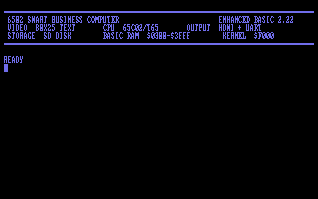
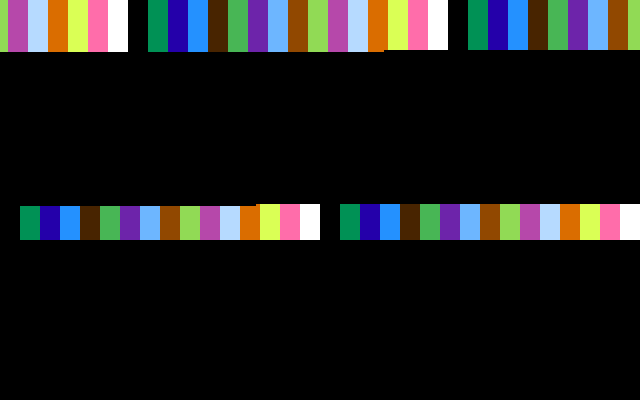
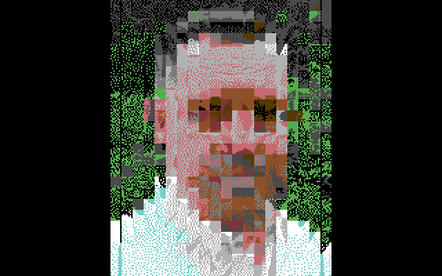
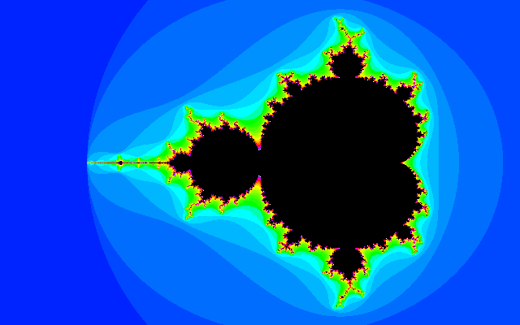
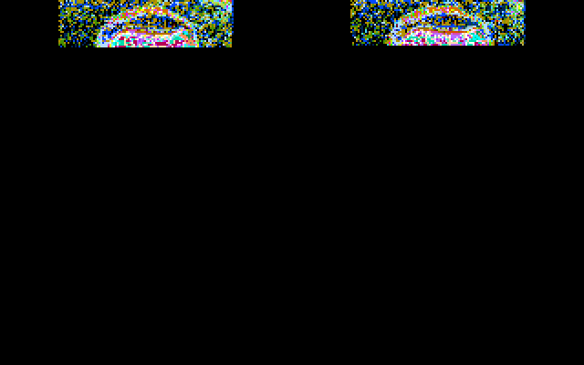

# FPGA Software Test

Generated: 2026-07-07 07:59:04

- Config: `fpga.ini`
- FPGA software root: `D:\Development\6502-sbc-fpga`
- Standard screenshot delay: `120` rendered frames
- Mandelbrot screenshot delay: `6000` rendered frames

| Status | Software | Type | Wait | Screenshot |
|---|---|---|---:|---|
| PASS | `D:\Development\6502-sbc-fpga\roms\6502\fpga_ehbasic_16kb.rom` | `rom` | `120` |  |
| PASS | `D:\Development\6502-sbc-fpga\roms\6502\raster_test.rom` | `rom` | `120` |  |
| PASS | `D:\Development\6502-sbc-fpga\roms\6502\fb16_test.rom` | `rom` | `120` |  |
| PASS | `D:\Development\6502-sbc-fpga\roms\6502\ich_image.rom` | `rom` | `120` |  |
| PASS | `D:\Development\6502-sbc-fpga\roms\6502\mandelbrot_bitmap.rom` | `rom` | `6000` |  |
| PASS | `D:\Development\6502-sbc-fpga\roms\6502\mandelbrot_hires.bin` | `bin` | `6000` |  |
| PASS | `D:\Development\6502-sbc-fpga\roms\6502\mandelbrot_true.bin` | `bin` | `6000` |  |
| PASS | `D:\Development\6502-sbc-fpga\roms\6502\cia_test.rom` | `rom` | `120` |  |
| PASS | `D:\Development\6502-sbc-fpga\roms\6502\imgdisk\img0.prg` `D:\Development\6502-sbc-fpga\roms\6502\imgdisk\showimg.prg` | `prg+prg` | `120` |  |
